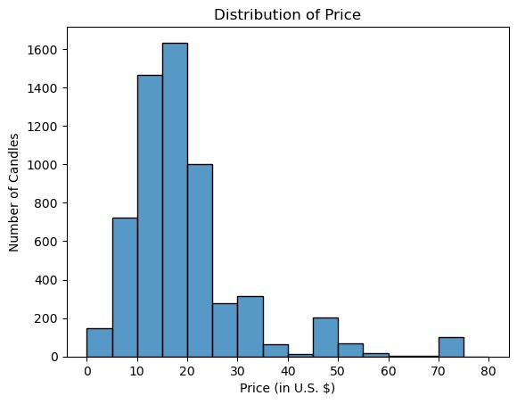
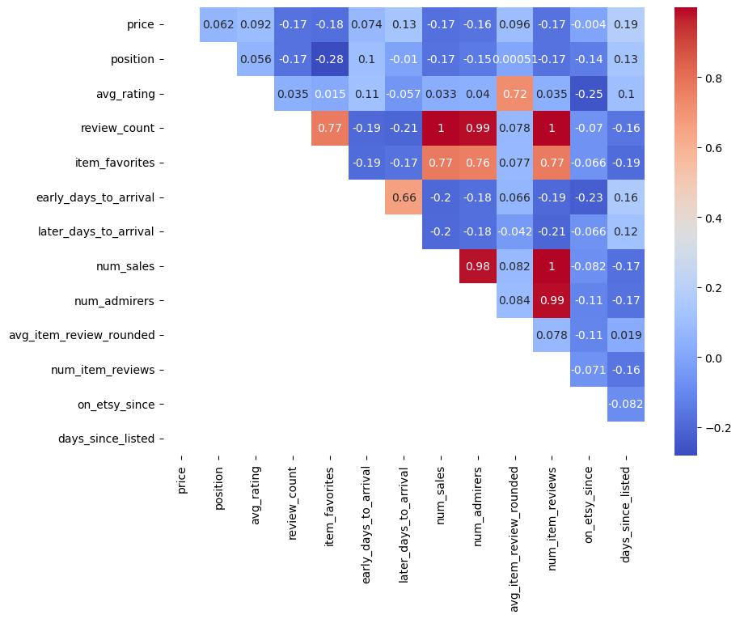
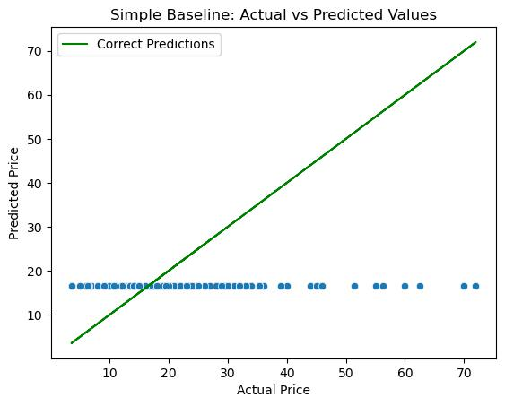

# Predicting Candle Sales Price on Etsy

Data on 6040 candles was scraped from the Etsy search results for candles (more information about the scraping process can be found [here](Archives/web-scraping.ipynb)) to build a [value-based pricing model](https://www.indeed.com/career-advice/career-development/pricing-modeling) for an entrepreneur who wants to start selling candles on Etsy (or re-price their candles), who wants to go beyond a simple cost-plus pricing model which doesn't take market demand into account.

The final model achieved an RMSE of \\$1.56 and an $R^2$ of 0.91 on the test set (with outliers removed), making it a reasonable model for pricing a "typical" candle sold on Etsy (a single candle being sold for \\$15 to \\$30.) For sets of candles or personalized candles, which tend to sell for a higher price, this model is not appropriate.

## Business Understanding

Determining a price for which to sell your products is an important aspect of starting an online retail business, and there are [multiple ways to do so](https://www.indeed.com/career-advice/career-development/pricing-modeling).

We set out to build a value-based pricing model using data scraped from the popular e-commerce store Etsy. A value-based model sets a price based on what consumers will likely pay for your product, rather than using your costs and ideal profit margin to set a price.

This model would be a great tool for someone who wants to explore the feasibility of starting an online retail business on Etsy before investing in the tools and knowledge needed to do so. The model could also be used by an established Etsy shop to re-price products following significant changes in the seller's Etsy statistics or item features.

## Data Understanding

### Distribution of Target

75\% of candles in the dataset were priced between \\$14 and \\$21, with 25\% of candles selling for less than \\$14 and 25\% selling for more than \\$21.

*Extreme outliers are not shown in the histogram above; the most expensive listing was for a custom order priced at \\$350, which is not representative of a typical candle for sale on Etsy.*

On casual inspection, listings for more than \\$21 may generally involve sets of candles or personalized candles, although further analysis (perhaps using NLP techniques) needs to be done to confirm this suspicion.

### Outliers

Our model excludes outliers, focusing on pricing a "typical" candle on Etsy.

The outliers excluded were determined based on the standard cutoff of 1.5 times the interquartile range of the training data above the third quartile or below the first quartile.

### Correlation of Features with Target

The correlation of other features with price was not particularly strong, although we do see some stronger negative correlation between measures of item or shop popularity and price, and some stronger positive correlation between price and length of listing. (Perhaps more affordable candles tend to be more popular, and more established shops tend to sell more expensive candles.)

## Modeling and Evaluation

Two primary types of regression models were built to predict candle price: linear, and tree-based ensemble models (random forest.)

All models were compared to each other and a simple baseline (the mean of the training data) using RMSE (root mean squared error.)

### Simple Baseline

A simple baseline model of predicting the mean of the training set achieved an RMSE of \\$11.34 on the validation set.

### Linear Model

A baseline multiple linear regression model achieved a validation RMSE of \\$10.94.

The best linear model obtained was a Lasso model with default regularization parameter value and degree 3 polynomial terms, achieving a validation RMSE of \\$5.65. The model's predictions on the validation dataset are quite similar to the simple baseline model of predicting the mean.

### Tree-Based Ensemble Model

Both a regular random forest and XG boost were trained on the training data and tuned using the validation data.

A tuned random forest performed the best on the validation data with an RMSE of \\$1.65.

## Conclusion

Based on RMSE alone, the best model does a decent job of pricing candles in the "acceptable price range" (within 1.5 times the interquartile range of the "middle half" of candle prices.)

For a seller focused on selling single, non-personalized candles, using this model to estimate a starting price for your product based on market demand is completely appropriate.

## Repository Structure

