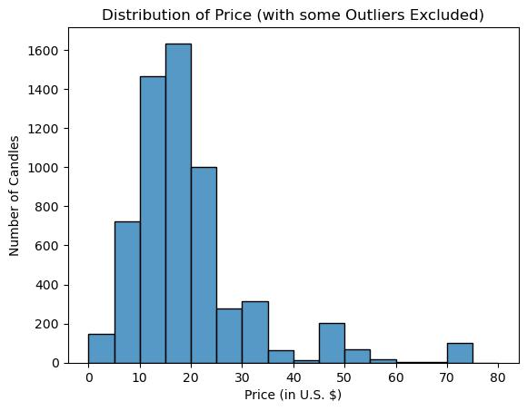

# Predicting Candle Sales Price on Etsy
## Rebecca Neel
## July 26, 2023

The purpose of this project is to build a value-based pricing model to allow an entrepreneur who wants to start selling candles on Etsy to set a price for their first candle.

The final model (regression model predicting the price of a candle listing) achieved an RMSE of \$1.65 and explains about 91% of the variance in the test set with outliers removed.

The model suggests that setting a price around \$21.50 (\$20-\$23) makes sense in the Etsy market for a new seller with no reviews on the e-commerce site yet.


## Business Understanding

Determining a price for which to sell your products is an important aspect of starting an online retail business, and there are [multiple ways to do so](https://www.indeed.com/career-advice/career-development/pricing-modeling).

I set out to build a value-based pricing model using data scraped from the popular e-commerce store Etsy. A value-based model sets a price based on what consumers will likely pay for your product, rather than using your costs and ideal profit margin to set a price. For the purposes of illustration, I chose to build a model for pricing a candle.

This model is one way to set a price for the first candle you want to sell on Etsy, using information about the market and other candles for sale from "similar" sellers in terms of Etsy statistics like average item rating and number of admirers.

## Data Understanding

### Distribution of Target

I scraped data on 6040 candles from the Etsy search results for candles (more information about the scraping process can be found [here](Archives/web-scraping.ipynb).) 50\% of candles in this dataset were priced between \$14 and \$21, with 25\% of candles selling for less than \$14 and 25\% selling for more than \$21.



*Extreme outliers (candles for more than \$80) are not shown in the histogram above; the most expensive listing was for a custom order priced at \$350, which is not representative of a typical candle for sale on Etsy.*

On casual inspection, listings for more than \$21 may generally involve sets of candles or personalized candles, although further analysis (perhaps using NLP techniques) needs to be done to confirm this suspicion.

### Outliers

Our model excludes outliers, focusing on pricing a "typical" candle on Etsy.

The outliers excluded were determined based on the standard cutoff of 1.5 times the interquartile range of the training data above the third quartile or below the first quartile. Candles priced between \$3.47 and \$31.52 were considered non-outliers.

### Correlation of Features with Target

The correlation of other features with price was not particularly strong.

We do see some stronger negative correlation between measures of item or shop popularity and price, and some stronger positive correlation between price and length of listing.

Perhaps more affordable candles tend to be more popular, and more established shops tend to sell more expensive candles.


## Modeling and Evaluation

Two types of regression models were built (and tuned) to predict candle price: a linear model, and a tree-based ensemble model (random forest and xgboost.)

All models were compared to each other and a simple baseline (the mean of the training data) using RMSE (root mean squared error.)

### Simple Baseline

A simple baseline model of predicting the mean of the training set achieved an RMSE of \$11.34 on the validation set.


### Linear Model

A baseline multiple linear regression model achieved a validation RMSE of \$10.94.

The best linear model obtained was a Lasso model with default regularization parameter value and degree 3 polynomial terms, achieving a validation RMSE of \$5.65. The model's predictions on the validation dataset are quite similar to the simple baseline model of predicting the mean.

### Tree-Based Ensemble Model

Both a regular random forest and XG boost were trained on the training data and tuned using the validation data.

A tuned random forest performed the best on the validation data with an RMSE of \$1.65.

### Conclusion

Based on RMSE alone, the best model does a decent job of pricing candles in the "acceptable price range" (within 1.5 times the interquartile range of the "middle half" of candle prices.)

## Recommendations

For a new seller on Etsy pricing your first candle, I suggest selecting a price close to \$21.50 (between \$20 and \$23) to match the typical price of a candle being sold by sellers with similar seller and listing statistics.

This recommendation is based on the best regression model found, a random forest regressor with a maximum depth of 15 and 50\% of features considered at each split, which achieved a validation RMSE of \$1.65.

## Repository Structure

```
├── Archives
├── images
├── model_data
├── .gitignore
├── README.md
├── candle-price-prediction_presentation.pdf
├── eda-modeling-evaluation.ipynb
└── requirements.txt
```

## Reproducibility

To reproduce the final and intermediate models on your own machine, clone this repository, create a virtual environment using the packages listed in requirements.txt, and run the notebook 'notebook.ipynb' (this will automatically utilize the data stored in model_data/data.csv.)

## More Information

For more information, please see the [presentation](presentation.pdf) and the [Jupyter notebook](notebook.ipynb).